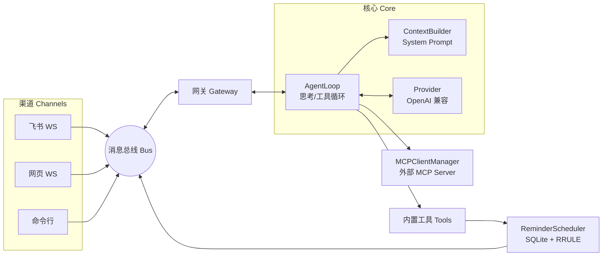

# NanoClaw

一个**本地优先、多渠道、可扩展**的个人 AI Agent 网关。

NanoClaw 把「大模型推理」与「消息渠道」解耦：模型在本地循环里思考、调用工具、对接外部 MCP Server，而飞书、网页等渠道只负责收发消息。所有对话通过一条**消息总线**在渠道与网关之间流转，新增渠道或工具都不用改动核心逻辑。

> 设计目标：单台设备跑一个或多个独立实例，每个实例对应一个人 / 一个场景；无全局单例，配置与运行时状态都在实例内部。

---

## 特性

- **多渠道接入**：飞书（WebSocket 长连接，支持收图与发送生成图片）、网页（aiohttp + WebSocket，含会话侧边栏、历史接回、断线自动重连）。
- **网页语音输入**：浏览器录音经可替换 ASR Provider 转成文字后，继续复用原有文本消息、会话与 Agent 流程。
- **网页自动朗读**：可选开启 `edge-tts`，按自然语义片段合成并顺序朗读 Agent 的新回复，默认关闭且不回放历史。
- **ReAct 工具循环**：模型自主决定调用工具（文件读写、目录列举、执行命令、子 Agent 委派等），带单轮迭代上限与墙钟超时熔断，防卡死。
- **MCP 扩展**：用 `MCPClientManager` 把任意 MCP Server 包装成本地工具（`{server}__{tool}` 命名），支持多 Server、超时容错、坏 Server 自动跳过。
- **可插拔 Provider**：基于 OpenAI 兼容接口，硅基流动 / 本地模型均可，支持流式输出。
- **会话持久化**：对话落盘为 JSONL，重启后可侧边栏查看、接上、删除。
- **人设可定制**：通过 `identity.md`（不随仓库发布）定义语气与角色；首次缺失时会在聊天渠道中引导用户创建。
- **长上下文优化**：System Prompt 把易变内容（当前时间）置于末尾，固定前缀稳定命中 Prompt Cache。
- **主动提醒**：CLI、Web 或飞书都能让 Agent 创建、查询、取消任务；到点只向显式绑定的飞书私聊发送，支持静态提醒和实时 Agent 任务。

---

## 架构



- **消息总线**：渠道与网关的运行时解耦层，避免相互直接依赖。
- **网关**：把入站消息转成 AgentLoop 请求、把出站回复按渠道回写。
- **AgentLoop**：核心推理循环，按 `tools` 定义决定是否调用工具，最多 `max_iterations` 步，整轮受 `turn_timeout_sec` 墙钟保护。
- **System Prompt** 由 `ContextBuilder` 动态拼接：`人设 → 工作区 → 长期记忆 → 记忆指引 → 可用技能 → 当前时间（末尾）`。

---

## 目录结构

```
nanoclaw/
├── main.py                 # 入口：装配总线/渠道/网关并驱动运行
├── gateway.py              # 网关：入站/出站消息路由
├── config.py               # 配置加载（默认值 → config.json → 环境变量）
├── config.example.json     # 配置占位模板（复制为 config.json 后填值）
├── agent/
│   ├── context.py          # System Prompt 拼接
│   ├── loop.py             # AgentLoop 推理循环
│   ├── skills.py           # 技能摘要构建
│   └── tools/              # 内置工具 + MCP 接入层（mcp.py）
├── bus/                    # 消息总线
├── channels/               # 渠道：feishu.py / web.py / cli.py
├── providers/              # 模型 Provider（OpenAI 兼容，支持流式）
├── reminders/              # RRULE、SQLite 状态机、调度器和应用服务
├── voice/                  # 音频规范化与可替换 ASR Provider
├── session/                # 会话管理（JSONL 持久化）
├── skills/                 # 本地技能（SKILL.md）
├── mcp_servers/            # 示例 MCP Server（如 poetry_server.py）
└── webui/                  # 网页前端（index.html）
```

> 以下文件**不随仓库发布**（含密钥或个人信息）：`config.json`、`.workbuddy/`、`workspace/`、`sessions/`、`identity.md`、`deploy/`、`scripts/`。

---

## 快速开始

### 1. 前置

- Python 3.13+（推荐用 [uv](https://github.com/astral-sh/uv) 管理环境）
- 一个 OpenAI 兼容的模型 API Key
- 使用网页语音输入时需额外安装 `ffmpeg`/`ffprobe`，并配置支持 `/audio/transcriptions` 的 ASR 服务

### 2. 安装依赖

```bash
uv sync          # 按 pyproject.toml + uv.lock 安装到 .venv
```

### 3. 配置

复制模板并填入你的密钥：

```bash
cp config.example.json config.json
# 编辑 config.json，至少填写 api_key / model / base_url
```

也可用环境变量注入敏感信息（优先级最高，避免写盘）：

```bash
export NANOCLAW_API_KEY="sk-..."
export FEISHU_APP_ID="cli_..."
export FEISHU_APP_SECRET="..."
export ASR_API_KEY="sk-..."       # 仅网页语音识别需要
```

### 4. 运行

```bash
uv run python main.py
```

默认只启用命令行渠道。要开网页渠道，把 `config.json` 里的 `web_port` 设为非零（如 `8080`），浏览器打开 `http://<本机IP>:8080/`。

---

## 配置说明

所有字段见 `config.example.json`：

| 字段 | 说明 | 默认 |
|---|---|---|
| `api_key` | 模型 API Key（建议用环境变量注入） | 空（依赖 `NANOCLAW_API_KEY`） |
| `base_url` | OpenAI 兼容接口地址 | 硅基流动 `https://api.siliconflow.cn/v1` |
| `model` | 主模型名 | `Pro/moonshotai/Kimi-K2.5` |
| `subagent_model` | 子 Agent 模型（留空沿用主模型） | 空 |
| `workspace` | 工具可访问的工作区根目录 | `.` |
| `max_iterations` | 单轮最大工具迭代次数 | `32` |
| `identity_file` | 人设文件名（位于 workspace 下） | `identity.md` |
| `feishu_app_id` / `feishu_app_secret` | 飞书自建应用凭证（留空则不启用飞书） | 空 |
| `feishu_image_merge_window_sec` | 飞书图片等待后续文字说明的秒数；连续图片会重置计时，`0` 表示立即处理 | `10` |
| `web_host` / `web_port` | 网页渠道监听地址 / 端口（`0`=不启用） | `0.0.0.0` / `0` |
| `turn_timeout_sec` | 单轮墙钟超时（秒），超时强制终止 | `600` |
| `mcp_servers` | 外部 MCP Server 配置 | `{}` |
| `image_gen_model` | 生图服务配置；`timeout_sec` 是单次 HTTP 请求上限，`total_timeout_sec` 是包含重试、退避与下载的整次任务预算 | 单次 `120` 秒 / 总计 `600` 秒 |
| `asr_model` | 网页语音识别 Provider、模型、地址、超时、大小与 FFmpeg 配置 | 默认关闭 |
| `tts_model` | 网页自动朗读的 Provider、音色、语速、超时与资源上限 | Edge TTS 后端就绪，页面默认关闭 |
| `reminders` | 主动提醒开关、独立 SQLite 路径、回执/lease/低频校时与重试上限；均在重启后生效 | 启用，`workspace/reminders.db` |

---

## 渠道

### 飞书

1. 在[飞书开放平台](https://open.feishu.cn/)创建**自建应用**，开启「机器人」能力；
2. 把 `App ID` / `App Secret` 填入 `config.json`（或环境变量）；
3. 在应用权限中开通接收消息、以应用身份发送消息、读取消息资源和上传图片资源等权限，并订阅“接收消息”事件；
4. 运行后应用会建立 WebSocket 长连接，自动重连。

飞书私聊支持直接发送 PNG、JPEG、GIF、WEBP 或 BMP 图片，图片会复用网页端已有的视觉理解流程；Agent 或子 Agent 通过 `generate_image` 产生的图片会作为飞书图片消息发送。收到图片后默认等待 10 秒：同一用户随后发送的文字会与图片合并，连续发送图片会重置等待时间；超时后才使用默认图片分析提示。可通过 `feishu_image_merge_window_sec` 调整或关闭等待，修改后需重启实例。入站图片当前限制 20 MB，出站图片遵循飞书上传接口的 10 MB 限制。群聊仍遵守“仅被 @ 时响应”的规则，因此第一版建议在私聊中使用纯图片消息。

主动提醒首次使用时，在与机器人的飞书私聊中发送 `/bind-reminders`。绑定成功后，
可以从飞书、Web 或 CLI 用自然语言让 Agent 创建、查询或取消任务；任务始终发送到
该已绑定私聊。`message` 任务到点直接发送创建时写好的正文，`agent` 任务到点才运行
独立 Agent 会话获取实时内容。发送 `/unbind-reminders` 会暂停目标调度但保留任务，
同一飞书用户重新绑定后恢复。绑定命令不接受群聊，一个实例也不能改绑给另一用户。
“每隔一天”等存在不同理解时，Agent 会先确认，并在创建成功后列出未来最多三次时间。

### 网页

- 设 `web_port` 为非零端口，启动后访问 `http://<本机IP>:<端口>/`；
- 支持流式思考过程、逐字输出、会话侧边栏（历史查看 / 接回 / 删除）；
- 子 Agent 执行过程会显示为独立的可折叠面板，包括层级、状态、内部工具和耗时；重新打开历史会话时仍可查看结果，旧版会话也会从已有工具记录尽量恢复；
- 配置 `asr_model.enabled=true` 后，可点击录音按钮开始/停止录音并转写；音频仅作临时处理，成功后仍按普通文本消息发送；
- 喇叭按钮默认关闭；开启后按自然语义片段朗读 Agent 后续的新回复，再次点击会立即停止当前朗读；
- 断线后自动重连并接回当前会话。

浏览器麦克风要求安全上下文：本机开发可使用 `localhost`；从局域网其它设备访问时应通过 HTTPS 反向代理。ASR 的 `api_key` 建议只通过 `ASR_API_KEY` 注入，不在网页配置页展示。

自动朗读使用在线的 Microsoft Edge 语音服务：开启后，待朗读的 Agent 回复文本会发送到该外部服务。TTS 失败只会停止本轮朗读，不影响文字聊天；生成的 MP3 仅在浏览器内存中播放，不进入会话历史。

> 网页渠道默认**免登录、局域网信任**，请勿在公网裸暴露。需要访问码可在此基础上自行加固。

---

## MCP 扩展

把任意 MCP Server 接入为本地工具。示例（见 `mcp_servers/poetry_server.py`，基于 `mcp` 库的 `FastMCP`）：

```json
// config.json
"mcp_servers": {
  "poetry": {
    "command": "uv",
    "args": ["run", "python", "mcp_servers/poetry_server.py"]
  }
}
```

启动后，Server 暴露的工具会以 `poetry__search_poetry`、`poetry__random_poetry`、`poetry__list_poets` 这类名字自动注册进工具集，模型可直接调用。

- 多 Server 并行连接；单个 Server 连接超时 / 异常会被跳过并告警，不影响其余；
- `ClientSession` 手动 `__aenter__()` 以正确启动内部消息循环；
- 退出时按 session → stdio 顺序回收子进程。

---

## 人设定制

在 `<workspace>/identity.md`（或其它 `identity_file` 指向的工作区内文件）中定义角色、语气与交互风格。人设属于本机实例数据，不随仓库发布。

如果启动后没有找到非空人设文件，Web、飞书或 CLI 收到第一条普通消息时会先询问用户；用户下一条回复会被整理并原子写入人设文件。回复 `/default` 可生成默认人设。引导期间不会调用模型，也不会把人设描述写入会话历史；创建成功后需要重新发送原任务。

---

## Linux 后台管理

仓库提供 `bin/nanoclawctl`，用于 Linux 下后台启动、停止、重启和查看状态。脚本从自身位置推导项目目录，无需写死安装路径；PID 和日志默认保存在被 Git 忽略的 `.run/`。

```bash
./bin/nanoclawctl start
./bin/nanoclawctl status
./bin/nanoclawctl restart
./bin/nanoclawctl stop
./bin/nanoclawctl logs       # 可选：持续查看日志
```

脚本依赖 `bash`、`uv` 和 Linux `setsid`（通常由 `util-linux` 提供）。`stop` 会向独立进程组发送 `SIGTERM`，默认最多等待 30 秒让 NanoClaw 释放渠道和 MCP 资源，超时后才强制结束。通过环境变量注入的 API Key 必须在执行 `start` 的同一 shell 中可见；写在被忽略的 `config.json` 中则不受影响。

更新代码后推荐：

```bash
git pull --ff-only
uv sync --frozen
./bin/nanoclawctl restart
```

---

## 常驻运行

- **Linux 手动后台运行**：使用上面的 `bin/nanoclawctl`；如需开机自启和崩溃拉起，后续可再交给 systemd 托管；
- **macOS 防止空闲睡眠**：用 `caffeinate -i uv run python main.py`（插电时常开）；
- **macOS 登录自启**：用系统 `launchd` 托管（需自行编写 plist，注意用本机绝对路径）；
- **合盖离线**：macOS 合盖会睡眠、断开连接；要保证 7×24 在线，建议跑在常开机器（云服务器 / 旧 Mac mini / ARM64 Linux 设备）。飞书模式只需出网 WebSocket，无需公网 IP。

> 睡眠期间飞书推送的消息可能漏收（WS 模式不持久化队列）。需零漏消息请改用飞书 Webhook 回调 + 内网穿透。

---

## 开发

跨会话协作、验证矩阵和完成标准见 [`docs/DEVELOPMENT.md`](docs/DEVELOPMENT.md)；接手项目前先阅读 [`AGENTS.md`](AGENTS.md) 和 [`docs/ARCHITECTURE.md`](docs/ARCHITECTURE.md)。历史决策与当前遗留问题统一维护在 [`docs/DECISIONS.md`](docs/DECISIONS.md)。

```bash
uv run python -m compileall -q agent bus channels providers session  # 基础语法检查
uv run python -c "import main"                                      # 导入链冒烟
uv run python main.py                                                # 本地调试
```

仓库当前尚未建立正式测试套件；新增功能和 Bug 修复应按开发流程补充可重复的回归测试。

新增内置工具：在 `agent/tools/` 下继承 `Tool` 基类并实现 `name` / `description` / `parameters` / `execute` / `to_function_definition`。

---

## License

本项目仅供个人学习与使用。具体许可条款见仓库 LICENSE 文件（如有）。
