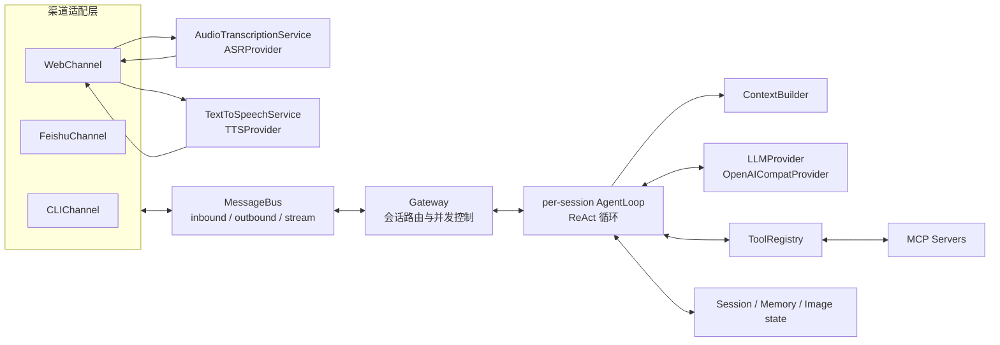
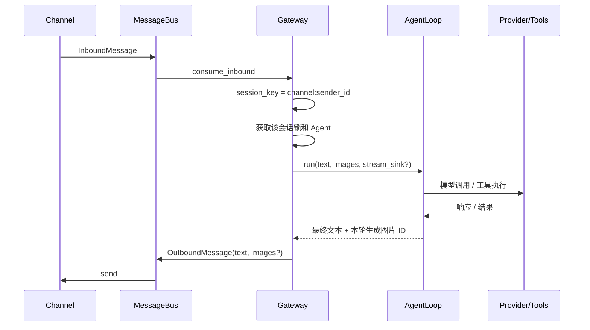

# NanoClaw 架构说明

## 1. 系统定位

NanoClaw 是一个本地优先、单进程、多渠道的个人 AI Agent 网关。它把渠道收发、会话调度、模型调用和工具执行拆开，通过进程内异步消息总线连接。默认部署模型是“一人/一场景一个独立进程实例”，而不是一个进程内运行多个长期自治 Agent。

审计基线：2026-07-26，Git 提交 `0daefc4`。本文描述当前代码，不把未落地的方案文档当成现状。

## 2. 技术栈

| 层 | 技术 | 作用 |
|---|---|---|
| 运行时 | Python 3.13+、`asyncio`、`uv` | 单体应用、异步编排、依赖与锁文件管理 |
| 模型 | `openai.AsyncOpenAI` | 调用 OpenAI-compatible Chat Completions，支持流式和工具调用 |
| Web | `aiohttp`、原生 HTML/CSS/JS | HTTP 配置/会话/图片 API、WebSocket 聊天与单页 UI |
| 飞书 | `lark-oapi` | WebSocket 长连接收文本/图片、IM API 发文本/图片 |
| 工具扩展 | 自定义 Tool API、MCP stdio | 内置工具注册和外部 MCP Server 接入 |
| 网络工具 | `httpx`、`ddgs`、`html2text` | 网页抓取、搜索、生图服务请求 |
| 语音输入 | MediaRecorder、FFmpeg/ffprobe、`httpx` | Web 录音、格式规范化、云端 ASR |
| 语音输出 | `edge-tts`、HTMLAudioElement | Web 新回复分段合成、顺序播放与取消 |
| 技能 | Markdown + YAML frontmatter | 技能发现、摘要注入与按需加载 |
| 数据 | JSONL、Markdown、图片文件、SQLite | 会话、长期/每日记忆、图片、LIKE 检索索引 |

运行依赖以 `pyproject.toml` 和 `uv.lock` 为准；当前没有数据库服务、ORM、前端构建工具或依赖注入框架。

## 3. 总体结构



依赖方向的核心约束：

- `main.py` 是唯一 composition root，手工创建并注入共享对象。
- Channel 不直接调用 Agent；Web 入站可在投递 Bus 前调用独立 ASR 服务把音频归一为文本。
- Gateway 依赖 Bus、Channel 抽象和 AgentLoop，负责按 `session_key` 调度。
- AgentLoop 依赖 Provider 抽象、ToolRegistry、ContextBuilder、SessionManager 和 MemoryConsolidation。
- 具体工具才依赖 `httpx`、`ddgs`、MCP 等外部能力。

## 4. 目录和模块职责

```text
nanoclaw/
├── main.py                 # 装配入口、共享对象、渠道和生命周期
├── gateway.py              # 入站调度、会话锁、出站/流事件路由
├── config.py               # 默认值 → config.json → 环境变量
├── config.example.json     # 可提交的配置模板
├── agent/
│   ├── loop.py             # 核心 ReAct、工具循环、流式事件、持久化
│   ├── context.py          # System Prompt 与 messages 构建
│   ├── identity.py         # 缺失人设时的跨渠道首次引导与原子落盘
│   ├── memory.py           # 超预算历史压缩与 HISTORY.md
│   ├── daily.py            # /clear 或压缩前的 best-effort 每日摘要
│   ├── search.py           # SQLite + LIKE 记忆/会话检索
│   ├── imagestore.py       # 按会话保存、解析和删除图片
│   ├── skills.py           # 扫描与解析 SKILL.md
│   ├── profiles.py         # 场景 Agent Profile v1/v2 读取与持久化
│   ├── scene_assets.py     # 场景私有 Skill/工具 manifest 资产边界
│   ├── tool_factories.py   # 受控私有 Tool 实例工厂
│   └── tools/              # Tool 抽象、Registry、内置工具、MCP 包装
├── bus/queue.py            # DTO 和三个 asyncio.Queue
├── channels/               # CLI、飞书、Web 渠道适配器
├── providers/              # 模型抽象和 OpenAI-compatible 实现
├── voice/                  # 音频校验/规范化、ASR/TTS 抽象与 Provider
├── bin/nanoclawctl         # Linux 后台进程启动、停止、重启与状态查询
├── session/manager.py      # 一会话一 JSONL、恢复和自愈
├── skills/                 # 运行时实际扫描的技能目录
├── mcp_servers/            # 示例 FastMCP Server
├── webui/index.html        # 无构建步骤的单页前端
├── docs/                   # 稳定项目与协作文档
└── workspace/              # 运行数据；被 Git 忽略
```

补充说明：

- `agent/skills/` 中存在一份历史技能副本，但运行时扫描的是 `<config.workspace>/skills/`；前者当前不是主技能入口。
- `list/` 是另一套本地虚拟环境，不是业务模块。
- `.workbuddy/`、`config.json`、`identity*.md`、`workspace/`、`deploy/`、`scripts/`、日志和个人图片均被忽略，不能作为公共仓库的稳定接口。

## 5. 关键运行流程

### 5.1 启动与装配

1. `main.main()` 进入 `asyncio.run(amain())`。
2. `build_shared()` 加载配置，创建基础 Provider、SkillsLoader、ToolRegistry、ContextBuilder、SessionManager、ImageStore、MemorySearcher、DailyMemory 和 MemoryConsolidation。
3. 启动时重建记忆/会话 SQLite 索引。
4. MCPClientManager 按配置拉起 stdio Server，并把远端工具包装进同一个 ToolRegistry。
5. 根据终端、飞书凭证和 `web_port` 启用 Channel。
6. 启动渠道任务及 Gateway 的入站、出站、流事件三个消费循环。

若配置的人设文件不存在或为空，Gateway 会在创建会话 Agent 前调用实例级 `IdentityBootstrapper`。首条消息只触发询问，同一会话下一条文本生成工作区内的人设文件；引导消息不调用模型、不进入会话历史。人设创建后 ContextBuilder 每轮重读文件，因此无需重启。多渠道并发由 Bootstrapper 的实例级锁协调，任一渠道完成后其它渠道直接进入正常流程。

Linux 后台控制脚本通过 `setsid` 建立独立进程组，并用 PID 文件校验 `/proc` 中的工作目录和命令行，避免陈旧 PID 误杀其它进程。`SIGTERM` 在 `main.py` 中转换为 asyncio 停止事件；Gateway 先取消并等待已登记的在途消息任务，再停止渠道并关闭 MCP 连接。

ASR 在启动期按 `asr_model` 配置装配并只注入 WebChannel。浏览器把完整录音上传到独立 HTTP 端点，WebChannel 在主事件循环调用共享转写服务；成功且非空的文本再通过原有 WebSocket 文本入口进入 MessageBus。音频字节、临时路径和 Provider 原始响应均不进入 Bus 或会话持久化。

TTS 同样在启动期按 `tts_model` 装配并只注入 WebChannel，但不进入 MessageBus。网页仅在用户主动开启朗读后，从实时 Agent `token/done` 事件按标点和长度切分新回复，经独立 HTTP 端点合成短 MP3；当前片段播放时预合成下一片段。关闭朗读、发送新消息、切换会话或断线会取消请求并清空播放状态，历史回放不会触发 TTS。

飞书图片沿用同一套渠道无关协议。入站 `image` 事件先建立按 chat、会话序号和发送者隔离的待处理批次，再用消息 ID 与 `image_key` 调飞书鉴权资源接口下载；校验通过后保存到共享 `ImageStore`。批次默认等待 10 秒接收后续文字，连续图片会重置计时；文字到达或计时结束后，整批图片作为一条 `InboundMessage.images` 进入既有视觉链路。下载期间即使用户切换会话，图片仍归属事件到达时的会话序号。出站时 `AgentLoop` 汇总本轮（含子 Agent）生成的图片 ID，Gateway 在原会话中解析为 `ImageRef` 并放入 `OutboundMessage.images`；飞书 Channel 上传图片取得 `image_key` 后发送 `image` 消息。Web 上传本身就是单条图文消息，不使用飞书的等待合并机制；Web 的图片展示继续使用流事件，不重复消费最终出站图片。

### 5.2 消息与并发



Gateway 每条入站消息创建任务；同一会话竞争同一把锁而串行，不同会话使用不同锁并发。Agent 实例和锁按 session_key 缓存。

Web 是唯一启用细粒度流事件的渠道：`thinking`、`token`、`tool_call`、`tool_result`、`image`、`subagent_event`、`done` 经 stream queue 回到 WebSocket。子 Agent 的内部事件统一包装在 `subagent_event` 中，避免其 `token/done` 混入父回复或触发 TTS。最终 OutboundMessage 标记 `streamed=True`，防止前端重复显示。

### 5.3 ReAct 和工具

1. ContextBuilder 每轮重读 identity、USER 和 MEMORY，构建 system prompt。
2. 加入会话历史和当前 user；图片按基础模型是否多模态选择直传或工具路径。
3. 超过约 192k 的启发式 token 预算时，旧消息被总结为一条 system 摘要。
4. Provider 返回最终回答或 tool calls。
5. ToolRegistry 统一按名调用工具并把异常转成字符串。普通工具默认使用 180 秒兜底超时，Shell 另有 60 秒内部超时；`spawn_subagent` 由子 Agent 自身的回合上限管理，生图使用独立的单请求超时和整次任务预算。
6. 工具结果加入 messages 后继续模型循环，直到最终回答、单轮超时、最大迭代数或熔断。

内置能力包括文件读写/列目录、Shell、Web 搜索/抓取、技能枚举/加载、记忆检索、视觉理解、生图和临时子 Agent。MCP 工具使用 `{server}__{tool}` 命名。

子 Agent 分为通用临时模式和 Profile 驱动的场景模式。场景 Agent 运行时仍是临时
`AgentLoop`，但可从 `workspace/agents/<name>/` 装配独立 System Prompt、共享能力
白名单、私有 Skill 和受控私有工具实例。私有工具只能由代码预注册 factory 创建；
场景模式允许按 Profile 显式装配 Shell、递归派生、全局记忆、视觉/生图和 MCP，
但硬拒绝修改 Agent/Profile/私有资产的控制面 API；递归派生绑定父场景过滤后的
工具表。其普通文件工具额外使用 realpath 保护 Agent 控制面和 Skill 目录。完整契约见
`docs/SCENE_AGENTS.md`。

### 5.4 持久化和记忆

默认 `config.workspace="."` 时，运行数据落在项目根下的 `workspace/`：

```text
workspace/
├── agents/
│   └── <agent>/
│       ├── profile.json
│       ├── skills/<skill>/SKILL.md
│       └── tools/<tool>.json
├── sessions/
│   ├── <safe_session_key>.jsonl
│   └── <safe_session_key>_images/
└── memory/
    ├── USER.md
    ├── MEMORY.md
    ├── HISTORY.md
    ├── followups.jsonl
    ├── daily/YYYY-MM-DD.md
    └── index.db
```

- JSONL 保存 user、assistant 和 tool 消息；system prompt 每轮重建，不落盘。
- 图片只落原始字节和轻量引用，不把 base64 写进 JSONL。
- 子 Agent 图片沿用父会话 key；父 `assistant(tool_calls)` 记录保存有界的 `subagent_runs` 回放摘要和 `generated_images`。这些 UI 元数据在恢复模型上下文前会被剥离。
- USER 偏长期个人信息，MEMORY 偏项目/工作事实，HISTORY 保存压缩轨迹，daily 保存 best-effort 事件摘要。
- MemorySearcher 启动时重建全部索引；每次搜索只刷新记忆文件部分，会话索引在当前进程内不会实时更新。

## 6. 配置生效边界

配置优先级为代码默认值 < `config.json` < 对应环境变量。Web 配置页会修改内存对象并写回文件，但热更新不是全量重建：

- 新会话会使用新的主 Provider/model/identity 配置。
- 已存在的 Agent 保持原配置。
- Web host/port、MCP 连接、技能摘要、工具注册、workspace 绑定、共享记忆 Provider 等启动期对象需要重启才能一致生效。
- `base_model_multimodal` 决定是否注册 `ask_image`，因此修改后必须重启。
- `asr_model` 和 `tts_model` 都是启动期服务配置；页面的 TTS 喇叭开关只是当前标签页内存状态，刷新后默认关闭。

## 7. 扩展点

| 需求 | 推荐落点 | 必须同步检查 |
|---|---|---|
| 新渠道 | `channels/<name>.py` 实现 Channel | Inbound/Outbound DTO、session_key、启动/停止、异常路径 |
| 新模型协议 | `providers/` 实现 LLMProvider | 流式 tool call 拼装、reasoning、错误/重试语义 |
| 新 ASR Provider | `voice/asr/` 实现 ASRProvider | 音频上限、超时/重试、空文本、临时文件清理 |
| 新 TTS Provider | `voice/tts/` 实现 TTSProvider | 文本/输出上限、超时、取消、隐私和浏览器播放格式 |
| 新内置工具 | `agent/tools/` + `main.py` 注册 | schema、超时、workspace/网络安全、同类工具风格 |
| 新 MCP 能力 | `config.mcp_servers` 或 `mcp_servers/` | stdio 生命周期、命名冲突、启动超时 |
| 新流事件 | `agent/loop.py` → Bus → Gateway → WebChannel → UI | 正常、错误、超时都必须产生最终 `done` |
| 新配置字段 | dataclass、`_CONFIG_FIELDS`、example、Web UI/API | 默认值、环境变量、秘密脱敏、热更新/重启语义 |
| 会话/图片元数据 | Loop、SessionManager、ImageStore、Web 历史 | API 消息格式与落盘格式必须分离 |

## 8. 当前架构风险摘要

完整状态与证据见 [DECISIONS.md](DECISIONS.md)。最需要优先处理的是：

1. Web 管理面免认证，配置 GET 原样返回 API Key/飞书 Secret，且启用时通常监听 `0.0.0.0`。
2. 注释所称 workspace 边界不是真实沙箱：符号链接、Shell 绝对路径/`cd ..` 和网络工具仍可越界。
3. 当前没有 CI、lint 或类型检查基线，自动化回归仍需继续扩充。
4. 工具循环在第 10 次重复时停止累计，导致计划中的第 20 次硬熔断不可达。
5. 会话 key 使用 `:`/`_` 互换，映射有损且可能碰撞；飞书 ID 常含下划线。
6. 队列、任务和会话缓存没有背压/回收策略；Channel 的 stop 也未真正关闭后台服务。
