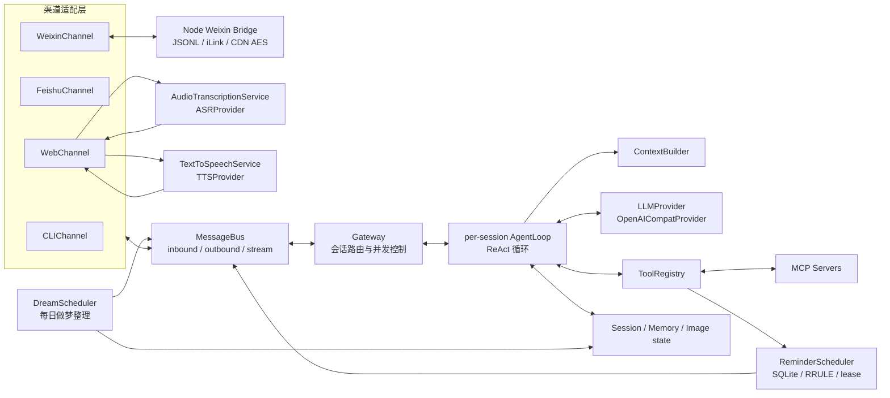
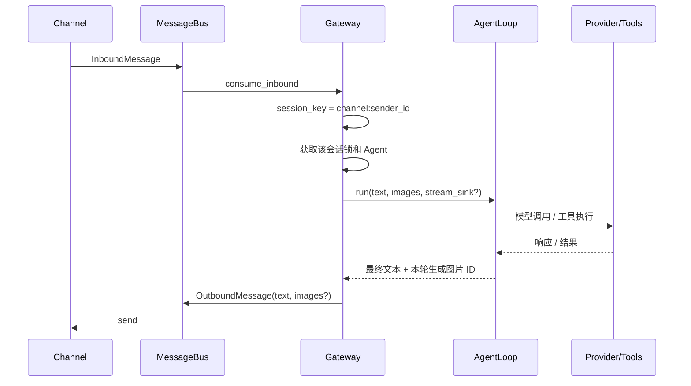
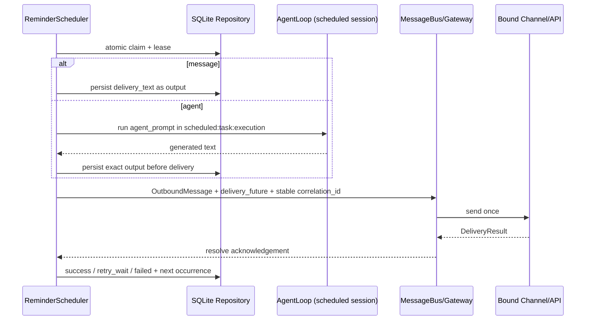

# NanoClaw 架构说明

## 1. 系统定位

NanoClaw 是一个本地优先、单进程、多渠道的个人 AI Agent 网关。它把渠道收发、会话调度、模型调用和工具执行拆开，通过进程内异步消息总线连接。默认部署模型是“一人/一场景一个独立进程实例”，而不是一个进程内运行多个长期自治 Agent。

审计基线：2026-08-04，Git 提交 `0cd50de`。本文描述当前代码，不把未落地的方案文档当成现状。

## 2. 技术栈

| 层 | 技术 | 作用 |
|---|---|---|
| 运行时 | Python 3.13+、`asyncio`、`uv` | 单体应用、异步编排、依赖与锁文件管理 |
| 模型 | `openai.AsyncOpenAI` | 调用 OpenAI-compatible Chat Completions，支持流式和工具调用 |
| Web | `aiohttp`、原生 HTML/CSS/JS | HTTP 配置/会话/图片 API、WebSocket 聊天与单页 UI |
| 飞书 | `lark-oapi` | WebSocket 长连接收文本/图片、IM API 发文本/图片 |
| 微信 | Python `asyncio` + Node.js 20+ JSONL Bridge | iLink 扫码、长轮询、CDN AES 与私有持久状态 |
| 工具扩展 | 自定义 Tool API、MCP stdio | 内置工具注册和外部 MCP Server 接入 |
| 网络工具 | `httpx`、`ddgs`、`html2text` | 网页抓取、搜索、生图服务请求 |
| 语音输入 | MediaRecorder、FFmpeg/ffprobe、`httpx` | Web 录音、格式规范化、云端 ASR |
| 语音输出 | `edge-tts`、HTMLAudioElement | Web 新回复分段合成、顺序播放与取消 |
| 技能 | Markdown + YAML frontmatter | 技能发现、摘要注入与按需加载 |
| 数据 | JSONL、Markdown、图片文件、SQLite | 会话、长期/每日记忆、图片、LIKE 检索索引 |

运行依赖以 `pyproject.toml` 和 `uv.lock` 为准；当前没有数据库服务、ORM、前端构建工具或依赖注入框架。

## 3. 总体结构



依赖方向的核心约束：

- `main.py` 是唯一 composition root，手工创建并注入共享对象。
- Channel 不直接调用 Agent；Web 入站可在投递 Bus 前调用独立 ASR 服务把音频归一为文本。
- Gateway 依赖 Bus、Channel 抽象和 AgentLoop，负责按 `session_key` 调度。
- AgentLoop 依赖 Provider 抽象、ToolRegistry、ContextBuilder、SessionManager 和每会话独立的 ContextCompactor（TASK-006 起不再共享压缩器实例）。
- 具体工具才依赖 `httpx`、`ddgs`、MCP 等外部能力。
- ReminderScheduler 只依赖异步仓储协议、Agent runner 和 Bus delivery 回调；SQLite 是任务事实源。
- DreamScheduler 是独立 asyncio 后台 task，直接消费 SessionManager/DailyMemory/Provider，与 ReminderScheduler 并存互不影响。

## 4. 目录和模块职责

```text
nanoclaw/
├── main.py                 # 装配入口、共享对象、渠道和生命周期；DreamScheduler/DreamState 装配与启动补做
├── gateway.py              # 入站调度、会话锁、出站/流事件路由
├── config.py               # 默认值 → config.json → 环境变量
├── config.example.json     # 可提交的配置模板
├── agent/
│   ├── loop.py             # 核心 ReAct、工具循环、流式事件、持久化
│   ├── context.py          # System Prompt 与 messages 构建
│   ├── identity.py         # 缺失人设时的跨渠道首次引导与原子落盘
│   ├── memory.py           # 超预算历史压缩（TASK-011 起压缩摘要不再写 HISTORY.md）
│   ├── daily.py            # 每日记忆：/clear 摘要 append + 每日做梦整理（固定分类/去重/合并更新，TASK-011）
│   ├── search.py           # SQLite + LIKE 记忆/会话检索
│   ├── imagestore.py       # 按会话保存、解析和删除图片
│   ├── skills.py           # 扫描与解析 SKILL.md
│   ├── profiles.py         # 场景 Agent Profile v1/v2 读取与持久化
│   ├── scene_assets.py     # 场景私有 Skill/工具 manifest 资产边界
│   ├── tool_factories.py   # 受控私有 Tool 实例工厂
│   └── tools/              # Tool 抽象、Registry、内置工具、MCP 包装
├── bus/queue.py            # DTO 和三个 asyncio.Queue
├── channels/               # CLI、飞书、Web 渠道适配器
├── integrations/
│   └── weixin_bridge/      # 固定上游源码、Node Bridge、NOTICE 与 Node 测试
├── providers/              # 模型抽象和 OpenAI-compatible 实现
├── reminders/              # DTO、RFC 5545、SQLite 仓储、调度器和应用服务
├── voice/                  # 音频校验/规范化、ASR/TTS 抽象与 Provider
├── bin/nanoclawctl         # Linux 后台进程启动、停止、重启与状态查询
├── session/manager.py      # 一会话一 JSONL、恢复和自愈
├── skills/                 # 运行时实际扫描的技能目录
├── mcp_servers/            # 示例 FastMCP Server
├── webui/index.html        # 无构建步骤的单页前端
├── docs/                   # 稳定项目与协作文档
└── workspace/              # 运行数据；被 Git 忽略
```

补充说明：

- `agent/skills/` 中存在一份历史技能副本，但运行时扫描的是 `<config.workspace>/skills/`；前者当前不是主技能入口。
- `list/` 是另一套本地虚拟环境，不是业务模块。
- `.workbuddy/`、`config.json`、`identity*.md`、`workspace/`、`deploy/`、`scripts/`、日志和个人图片均被忽略，不能作为公共仓库的稳定接口。

## 5. 关键运行流程

### 5.1 启动与装配

1. `main.main()` 进入 `asyncio.run(amain())`。
2. `build_shared()` 加载配置，创建基础 Provider、SkillsLoader、ToolRegistry、ContextBuilder、SessionManager、ImageStore、MemorySearcher、DailyMemory，以及启用时的 ReminderRepository/ReminderService；每会话的 ContextCompactor 由 make_agent_factory 内按 session 创建（TASK-006）。
3. 启动时重建记忆/会话 SQLite 索引。
4. MCPClientManager 按配置拉起 stdio Server，并把远端工具包装进同一个 ToolRegistry。
5. 根据终端、飞书凭证、`weixin.enabled` 和 `web_port` 启用 Channel。微信启用时
   额外启动一个 Node Bridge；Python 只传状态/受控图片目录，不接触登录秘密。
6. 启动渠道任务、Gateway 的入站/出站/流事件消费循环、单一 ReminderScheduler 与 DreamScheduler（每日做梦整理）；启动时若昨日未做整理（`dream_state.json` 的 `last_dream_date` 早于昨天）会异步补做前一天。关闭时先停止调度器，再停止出站分发和渠道。

若配置的人设文件不存在或为空，Gateway 会在创建会话 Agent 前调用实例级 `IdentityBootstrapper`。首条消息只触发询问，同一会话下一条文本生成工作区内的人设文件；引导消息不调用模型、不进入会话历史。ContextBuilder 在会话创建时读取 identity、USER、MEMORY 与场景 Agent 摘要并形成稳定快照；新会话或 `/clear` 才显式刷新。Skill 摘要继续是进程启动快照，修改后需重启。多渠道并发由 Bootstrapper 的实例级锁协调，任一渠道完成后其它渠道直接进入正常流程。

微信正常回合在进入 `AgentLoop.run()` 前建立一个不含秘密的本地 activity handle，覆盖模型推理、工具循环和子 Agent；人设引导不启动它。handle 随最终 `OutboundMessage` 交给出站分发，只有微信 `send` 收到 iLink 接受结果后才释放，因此不会先取消 typing 再发送回复。Bridge 按稳定 target 在内存中维护重叠 activity 计数，独占 context token/typing ticket，调用 vendor 对应的 `getconfig` 与 `sendtyping` 并按短周期续期；最后一个 activity 结束、错误、取消、session expired 或 shutdown 都走幂等 best-effort 清理。typing 失败不改变 Agent 或出站回答，微信也不使用 Web stream event。

内置工具注册完成、MCP 连接尽力而为结束后，ToolRegistry 按工具名生成确定性定义并冻结。成功连接的 MCP 集合是启动期 cache boundary；冻结后禁止继续热注册。每个用户回合再取得一次深拷贝快照，确保同一轮多次工具迭代使用完全相同的 Schema。

Linux 后台控制脚本通过 `setsid` 建立独立进程组，并用 PID 文件校验 `/proc` 中的工作目录和命令行，避免陈旧 PID 误杀其它进程。`SIGTERM` 在 `main.py` 中转换为 asyncio 停止事件；Gateway 先取消并等待已登记的在途消息任务，再停止渠道并关闭 MCP 连接。

ASR 在启动期按 `asr_model` 配置装配并只注入 WebChannel。浏览器把完整录音上传到独立 HTTP 端点，WebChannel 在主事件循环调用共享转写服务；成功且非空的文本再通过原有 WebSocket 文本入口进入 MessageBus。音频字节、临时路径和 Provider 原始响应均不进入 Bus 或会话持久化。

TTS 同样在启动期按 `tts_model` 配置装配并只注入 WebChannel，但不进入 MessageBus。网页仅在用户主动开启朗读后，从实时 Agent `token/done` 事件按标点和长度切分新回复，经独立 HTTP 端点合成短 MP3；当前片段播放时预合成下一片段。关闭朗读、发送新消息、切换会话或断线会取消请求并清空播放状态，历史回放不会触发 TTS。

飞书图片沿用同一套渠道无关协议。入站 `image` 事件先建立按 chat、会话序号和发送者隔离的待处理批次，再用消息 ID 与 `image_key` 调飞书鉴权资源接口下载；校验通过后保存到共享 `ImageStore`。批次默认等待 10 秒接收后续文字，连续图片会重置计时；文字到达或计时结束后，整批图片作为一条 `InboundMessage.images` 进入既有视觉链路。下载期间即使用户切换会话，图片仍归属事件到达时的会话序号。出站时 `AgentLoop` 汇总本轮（含子 Agent）生成的图片 ID，Gateway 在原会话中解析为 `ImageRef` 并放入 `OutboundMessage.images`；飞书 Channel 上传图片取得 `image_key` 后发送 `image` 消息。Web 上传本身就是单条图文消息，不使用飞书的等待合并机制；Web 的图片展示继续使用流事件，不重复消费最终出站图片。

### 5.2 消息与并发



Gateway 每条入站消息创建任务；同一会话竞争同一把锁而串行，不同会话使用不同锁并发。Agent 实例和锁按 session_key 缓存。

微信私聊使用稳定、可逆的 `account_id + user_id` target 同时作为 sender/chat ID，
会话不依赖临时 context token，也不会引入分隔符碰撞。Python Channel 把 Bridge
入站图片按 Gateway 的完整 `weixin:<target>` 会话键保存进共享 ImageStore；纯图片先按
配置窗口等待同一用户的后续文字或图片，合并后再作为一个 `InboundMessage` 投递；
持久批次只在 MessageBus 消费者确认取走该消息后删除，避免内存队列交接窗口静默丢图。
出站继续消费 Gateway 的 `OutboundMessage.content/images` 和可选 `delivery_future`。allowlist
为空时 deny-all，只有精确 user ID 或显式 `*` 才放行。`OutboundMessage` 的可选
`outbound_lifecycle` 只在进程内完成最终出站后的清理，不进入 Bus 的持久化、日志或
provider 请求；它不携带微信 context token 或 typing ticket。

Web 是唯一启用细粒度流事件的渠道：`thinking`、`token`、`tool_call`、`tool_result`、`image`、`subagent_event`、`done` 经 stream queue 回到 WebSocket。子 Agent 的内部事件统一包装在 `subagent_event` 中，避免其 `token/done` 混入父回复或触发 TTS。最终 OutboundMessage 标记 `streamed=True`，防止前端重复显示。

### 5.3 ReAct 和工具

1. ContextBuilder 使用会话级快照构建不含墙钟的稳定 System Prompt；当前时间仅在相关任务中通过 `get_current_time` 查询。
2. 加入会话历史和当前 user；图片按基础模型是否多模态选择直传或工具路径。
3. 估算消息、多模态 content 与工具 Schema；超过 `context_budget_tokens` 预算（默认 512k）时，ContextCompactor 把旧消息总结为一条 system 摘要，并记录稳定 head/tail 压缩边界（预算内原样返回、摘要失败保留原历史）。
4. Provider 返回最终回答或 tool calls。
5. ToolRegistry 统一按名调用工具并把异常转成字符串。普通工具默认使用 180 秒兜底超时，Shell 另有 60 秒内部超时；`spawn_subagent` 由子 Agent 自身的回合上限管理，生图使用独立的单请求超时和整次任务预算。
6. 工具结果加入 messages 后继续模型循环，直到最终回答、单轮超时、最大迭代数或熔断。

跨轮历史使用单一 canonical API 形式：`assistant(tool_calls) → tool` 顺序自愈，孤立 tool 丢弃，缺失结果用固定占位补齐；assistant 顶层 `reasoning_content`（若供应商要求工具循环重放）会在同进程、JSONL 与重启恢复中一致保留，但绝不进入单个 `tool_calls` 元素。这样最后一次工具请求能够成为下一用户回合的精确消息前缀。

每次 Provider 调用都会归一 OpenAI-compatible usage，并输出隐私安全的调用指标；压缩期间的历史摘要调用也带独立 `phase` 纳入同一回合（TASK-006 起压缩不再调 daily）。回合聚合只在所有调用都报告 cached tokens 时计算精确 `sum(cached)/sum(input)`。System/工具只记录短 SHA-256 hash，不记录其内容。流式路径请求 `include_usage`，不支持时降级并标为 unavailable。

内置能力包括文件读写/列目录、Shell、Web 搜索/抓取、技能枚举/加载、记忆检索、视觉理解、生图和临时子 Agent。MCP 工具使用 `{server}__{tool}` 命名。

子 Agent 分为通用临时模式和 Profile 驱动的场景模式。场景 Agent 运行时仍是临时
`AgentLoop`，但可从 `workspace/agents/<name>/` 装配独立 System Prompt、共享能力
白名单、私有 Skill 和受控私有工具实例。私有工具只能由代码预注册 factory 创建；
场景模式允许按 Profile 显式装配 Shell、递归派生、全局记忆、视觉/生图和 MCP，
但硬拒绝修改 Agent/Profile/私有资产的控制面 API；递归派生绑定父场景过滤后的
工具表。其普通文件工具额外使用 realpath 保护 Agent 控制面和 Skill 目录。完整契约见
`docs/SCENE_AGENTS.md`。

### 5.4 持久化和记忆

默认 `config.workspace="."` 时，运行数据落在项目根下的 `workspace/`：

```text
workspace/
├── agents/
│   └── <agent>/
│       ├── profile.json
│       ├── skills/<skill>/SKILL.md
│       └── tools/<tool>.json
├── sessions/
│   ├── <safe_session_key>.jsonl
│   └── <safe_session_key>_images/
├── memory/
│   ├── USER.md
│   ├── MEMORY.md
│   ├── HISTORY.md          # TASK-011 起不再写入（旧文件保留）
│   ├── dream_state.json    # 每日做梦整理状态（last_dream_date，TASK-011）
│   ├── followups.jsonl
│   ├── daily/YYYY-MM-DD.md
│   └── index.db
├── reminders.db            # 独立、不可重建的提醒事实库（WAL）
└── weixin/
    ├── state.json          # Bridge 独占凭据/cursor/context/去重（0600）
    ├── inbound/            # 等待搬入 ImageStore 的已解密临时图片
    └── outbound/           # Python 为 Bridge 暂存的受控出站图片
```

- JSONL 保存 user、assistant 和 tool 消息；system prompt 每轮重建，不落盘。
- 图片只落原始字节和轻量引用，不把 base64 写进 JSONL。
- 多模态历史在文件仍存在时按原字节重建，因此进程重启前后 API 形态一致；文件删除/变化是显式内容边界，且供应商是否缓存图片未知。
- 子 Agent 图片沿用父会话 key；父 `assistant(tool_calls)` 记录保存有界的 `subagent_runs` 回放摘要和 `generated_images`。这些 UI 元数据在恢复模型上下文前会被剥离。
- USER 偏长期个人信息，MEMORY 偏项目/工作事实；HISTORY 曾保存压缩轨迹（TASK-011 起不再写入，旧文件保留）；daily 保存 best-effort 事件摘要——`/clear` 追加写入 + 每日做梦整理（固定分类、去重、合并更新）。
- MemorySearcher 启动时重建全部索引；每次搜索前刷新记忆文件部分并**增量刷新会话索引**（TASK-012）：按会话文件 mtime/size 对比，只对变化/新增会话整会话重索引、对已删除（如 /clear）会话清索引，未变化跳过——新会话/新消息实时可搜，无需重启。
- Weixin 状态目录为 `0700`，状态文件原子替换。context token 按 account/user
  持久化；一批入站先保存 context、发事件并等待 Python ack，整批完成后才提交
  去重 ID 和 cursor。崩溃语义为 at-least-once：允许重复，不允许先推进 cursor
  导致静默丢消息。`-14` 表示凭据代次失效，会同时清除当前 account、cursor、
  context 和去重状态；重新扫码后必须由对端再次交互，不能复用旧代次 token。

#### 每日做梦整理（TASK-011）

`DreamScheduler` 在 `main.py` 中独立装配为一个 asyncio 后台 task：到
`dream_time`（默认 02:00，可注入时钟）触发一次整理，整理**当天**各会话发生
的事件；晚启动则立即补跑当天一次。启动时 `DreamState` 检查
`workspace/memory/dream_state.json` 的 `last_dream_date`：若早于昨天（或无记录），
异步补做**前一天**（只补最近 1 天、超期不回溯；状态单调前进，模型失败不更新
状态以便重启重试）。

数据源是 `collect_messages_for_date` 枚举各会话 JSONL 取该日消息（过滤
`<memory_patch>`/`<memory_snapshot>` 内部消息）+ 该日 daily 已有内容；经
`dream_consolidate` 调模型按固定分类（`## 用户变化 / ## 项目进展 / ## 会话总结`）
提取后由 `DailyMemory.write_dream` 合并写回：固定分类标题只出现一次、新事实按
「规范化行内容哈希」与文件内已有内容跨分类去重、非固定分类历史内容原样保留。
整理异步执行、失败静默，不阻塞聊天或启动；与 ReminderScheduler 独立 task
互不影响。

### 5.5 主动提醒与定时 Agent

`create_reminder`、`list_reminders`、`cancel_reminder` 是所有普通 Agent 会话共享的
工具。工具不接受 channel、chat/user ID；ReminderService 只从数据库中当前有效的
`target_id` 解析发送目标。目标只能由 FeishuChannel 或 WeixinChannel 在私聊中识别
确定性命令 `/bind-reminders`、`/unbind-reminders` 后写入。首次绑定的
`(channel, owner_id)` 在未显式释放时锁定实例，飞书与微信同一时刻二选一。当前 owner
主动解绑会持久标记为可换绑；下一次绑定原位更新同一个 target，因此历史任务与 execution
整体跟随新渠道。`session_expired`、`context_missing` 等系统暂停不设置可换绑状态，防止
掉线期间其它 allowlist 用户接管。每次绑定递增 `binding_revision`；迟到的旧渠道失败
回执只有在代次仍匹配时才能暂停目标，不能误伤已经换绑的新渠道。微信 recipient/owner
使用稳定可逆的 account/user target，context token 继续仅由 Bridge 持有。

任务保存本地 `DTSTART`、IANA timezone、规范 RFC 5545 RRULE 和
`next_run_at_utc`。ReminderScheduler 不做秒级轮询，也不为每个任务保留协程：它读取
SQLite 中最早唤醒时间，通过一个 `asyncio.Event` 和动态 timeout 等待。新建、取消、
重绑或重试会唤醒它；启动和低频安全校时会恢复过期 lease。一次性任务只在默认一小时
窗口内补发，周期任务只保留最近一次错过的 occurrence，下一次始终从计划时间推导。



动态任务使用 `scheduled:<task_id>:<execution_id>` 独立临时会话；生成后立即保存输出
并清理 SessionManager/ImageStore。发送失败只重发该输出，不重复调用 Agent。回执表示
目标渠道 API 已接受，不表示用户已读。微信使用 `reminder:<execution_id>` 作为稳定
correlation ID。主动解绑、微信会话过期或 context 缺失都会释放 claim 而不消耗三次
发送机会；主动解绑允许下次显式换绑，系统暂停则只允许原 owner 恢复。第一版采用
at-least-once：若进程在渠道接受后、SQLite 成功提交前崩溃，重启后仍存在极小概率
重复发送。

## 6. 配置生效边界

配置优先级为代码默认值 < `config.json` < 对应环境变量。Web 配置页会修改内存对象并写回文件，但热更新不是全量重建：

- 新会话会使用新的主 Provider/model/identity 配置。
- 已存在的 Agent 保持原配置。
- Web host/port、MCP 连接、技能摘要、工具注册、workspace 绑定、共享记忆 Provider 等启动期对象需要重启才能一致生效。
- `base_model_multimodal` 决定是否注册 `ask_image`，因此修改后必须重启。
- `timezone` 是实例默认 IANA 时区；`get_current_time` 在启动时校验，修改后需重启。
- `asr_model` 和 `tts_model` 都是启动期服务配置；页面的 TTS 喇叭开关只是当前标签页内存状态，刷新后默认关闭。
- `reminders` 的数据库路径、超时、lease、校时与尝试上限都是启动期配置；Web 保存后需重启。
- `dream_time` 是每日做梦整理时刻，属启动期配置；Web 保存后需重启。
- `weixin` 的 Bridge 命令、state dir、allowlist、IPC/登录/图片上限均为启动期配置；
  状态秘密不属于 `config.json`，加载/保存都会过滤 Bridge 独占字段。

## 7. 扩展点

| 需求 | 推荐落点 | 必须同步检查 |
|---|---|---|
| 新渠道 | `channels/<name>.py` 实现 Channel | Inbound/Outbound DTO、session_key、启动/停止、异常路径 |
| 新模型协议 | `providers/` 实现 LLMProvider | 流式 tool call 拼装、reasoning、错误/重试语义 |
| 新 ASR Provider | `voice/asr/` 实现 ASRProvider | 音频上限、超时/重试、空文本、临时文件清理 |
| 新 TTS Provider | `voice/tts/` 实现 TTSProvider | 文本/输出上限、超时、取消、隐私和浏览器播放格式 |
| 新内置工具 | `agent/tools/` + `main.py` 注册 | schema、超时、workspace/网络安全、同类工具风格 |
| 新 MCP 能力 | `config.mcp_servers` 或 `mcp_servers/` | stdio 生命周期、命名冲突、启动超时 |
| 新流事件 | `agent/loop.py` → Bus → Gateway → WebChannel → UI | 正常、错误、超时都必须产生最终 `done` |
| 新配置字段 | dataclass、`_CONFIG_FIELDS`、example、Web UI/API | 默认值、环境变量、秘密脱敏、热更新/重启语义 |
| 会话/图片元数据 | Loop、SessionManager、ImageStore、Web 历史 | API 消息格式与落盘格式必须分离 |

## 8. 当前架构风险摘要

完整状态与证据见 [DECISIONS.md](DECISIONS.md)。最需要优先处理的是：

1. Web 管理面免认证，配置 GET 原样返回 API Key/飞书 Secret，且启用时通常监听 `0.0.0.0`。
2. 注释所称 workspace 边界不是真实沙箱：符号链接、Shell 绝对路径/`cd ..` 和网络工具仍可越界。
3. 当前没有 CI、lint 或类型检查基线，自动化回归仍需继续扩充。
4. 工具循环在第 10 次重复时停止累计，导致计划中的第 20 次硬熔断不可达。
5. 会话 key 使用 `:`/`_` 互换，映射有损且可能碰撞；飞书 ID 常含下划线。
6. 队列、任务和会话缓存没有背压/回收策略；Channel 的 stop 也未真正关闭后台服务。
7. 微信社区基础仓库只在 `package.json` 声明 MIT、缺少独立 LICENSE；当前 vendor
   固定了来源和 NOTICE，但正式分发前仍需维护者/法律复核。真实腾讯端点兼容性
   也只能在明确授权扫码后手工验收，自动化使用 fake iLink HTTP/CDN/process。
8. Prompt Cache 是供应商能力：冷启动、显式上下文刷新、工具/MCP 集合变化和历史压缩会产生新前缀；工具 Schema、图片是否参与缓存键不能由 NanoClaw 保证。
