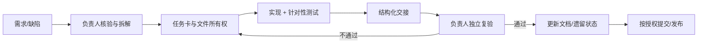

# 开发与跨会话协作流程

## 1. 目标

这套流程只解决四件事：任务边界清楚、多人不互相覆盖、结果可重复验证、下一会话能快速接手。短任务可以直接在派发消息里使用模板；跨会话、跨模块或超过半天的任务才建立任务卡。

## 2. 角色

| 角色 | 职责 | 不负责 |
|---|---|---|
| 项目负责人 | 澄清需求、拆任务、指定文件所有权、确认架构决策、独立验收、更新总状态 | 不直接采信“已完成”而跳过验证 |
| 实现会话/子 Agent | 在授权范围实现、保留测试、报告实际命令和结果 | 不扩大范围、不动他人文件、不自行 push/部署 |
| 审查者 | 只读检查 diff、协议、边界和回归风险 | 不与实现者同时改同一文件 |
| 集成负责人 | 统一跨层协议、共享入口和最终联调 | 不把冲突处理分散给多个写入者 |

小任务可由同一会话兼任实现和集成，但最终验收仍由项目负责人完成。

## 3. 任务生命周期



### 3.1 接收与核验

项目负责人先确认：

- 用户可见结果是什么；如何判断完成。
- 是纯诊断、方案设计还是授权实现。
- 当前 Git 基线、工作区已有改动和运行实例状态。
- 是否涉及秘密、个人数据、付费 API、外部消息、部署或破坏性操作。
- 相关架构入口和历史决策，尤其是 `docs/DECISIONS.md` 中的已知问题。

### 3.2 拆解

每个子任务应满足：可独立理解、可独立实现、可独立验证，且文件范围尽量不重叠。

拆分建议：

- 调研、实现、审查可以并行，但调研/审查默认只读。
- 跨 `Channel → Bus → Gateway → AgentLoop → UI` 的协议变更先定义一个字段/事件契约，再按层拆分。
- `main.py`、`config.py`、`config.example.json`、`agent/loop.py`、`channels/web.py` 等高冲突文件只交给一个集成负责人。
- 同一工作目录下不能让两个会话同时写同一文件；若无法隔离 worktree，就按文件串行。

### 3.3 派发

派发消息必须包含：任务 ID、目标、非目标、基线、允许/禁止修改、相关入口、验收标准、验证要求和输出格式。长任务复制 [任务模板](tasks/TEMPLATE.md)。

会话 ID 和职责由项目负责人维护；执行者不得自行改变中央任务状态或重新分配其他会话。

### 3.4 实现

执行者遵循：

1. 先读 `AGENTS.md`、任务卡和相关代码。
2. 检查 `git status --short --branch`，识别已有改动。
3. 先写或明确复现，再做最小范围修复。
4. 使用 `apply_patch` 做手工文件修改；依赖只用 `uv`。
5. Bug 修复保留回归测试，不把唯一测试脚本删掉。
6. 发现范围外问题只记录到交接；除非负责人扩权，不顺手修。

### 3.5 交接与验收

实现者按模板回传，项目负责人必须：

- 检查实际 diff 和文件范围。
- 复跑关键命令，而非只引用实现者结论。
- 检查正常、错误、超时/中断和恢复路径。
- 核对配置模板、用户文档和架构/遗留文档是否同步。
- 确认未带入 key、`config.json`、workspace、日志、图片或他人改动。

未达到完成标准则回到任务卡，不用模糊的“基本完成”。

## 4. Git 与冲突管理

- 默认分支名：`codex/<task-id>-<slug>`；长任务优先独立 worktree。
- 每个任务开始和交接都记录基线 commit 与 `git status --short`。
- 同一文件同一时刻只有一个写入负责人。共享协议先写契约，集成负责人最后合并。
- 不使用 `git reset --hard`、`git checkout --` 等覆盖命令处理他人工作。
- Commit 应原子化，只含任务文件；提交前检查 staged diff 和秘密。
- 未获用户授权，不 commit、push、建 PR 或部署。授权发布时仍先由项目负责人验收。

## 5. 验证矩阵

当前仓库还没有正式测试基线，以下是最低要求，不代表替代测试。建立 pytest 后，所有命令再加全量测试。

| 改动类型 | 最低验证 | 重点边界 |
|---|---|---|
| 所有改动 | `git diff --check`；复核 `git status --short` | 越界文件、秘密、个人数据 |
| Python | `uv run python -m py_compile <changed.py...>`；`uv run python -c "import main"` | import、副作用、Python 3.13 |
| AgentLoop / Provider | 离线 mock 回归 + 正常/错误/超时 | tool-call 顺序、stream `done`、持久化恢复 |
| Session / Memory | 临时目录测试 + 重启读取 | JSONL 顺序、坏行、自愈、key 编码、压缩覆写 |
| Tool | schema、成功、失败、超时；同类风格对照 | workspace、symlink、参数注入、输出截断 |
| 配置 | load/save round-trip + example 同步 | 环境变量、秘密脱敏、热更新/重启边界 |
| Web 后端 | aiohttp 临时端口 HTTP/WS 冒烟 | 鉴权、配置秘密、穿越、断线、最终 `done` |
| Web UI | 提取内联 JS 后 `node --check` + 浏览器关键流程 | 缓存版本、重连、流式/图片/历史 |
| 飞书 | SDK mock/fixture；真实环境需显式授权 | 线程投递、群聊 @、限流、文本/图片类型 |
| MCP | 临时 Server 的 stdio 握手、list_tools、调用、shutdown | 坏 Server、超时、同名、子进程回收 |
| 图片/视觉/生图 | 临时图片 + fake endpoint；真实服务另行授权 | MIME、大小、路径、多个来源、历史回放 |
| 并发/生命周期 | 多 session 并发、同 session 排队、shutdown | task 泄漏、锁、后台线程、队列背压 |
| Linux 控制脚本 | `bash -n bin/nanoclawctl` + 未运行时 status/stop；Linux 真机 start/stop 冒烟 | PID 复用、进程组、SIGTERM 清理、日志路径 |

不需要 API Key 的文档/静态审计不应启动真实模型。需要真实外部服务的验证必须说明成本、数据和副作用，并取得授权。

## 6. 完成标准（Definition of Done）

只有同时满足下列条件，负责人才能宣布任务完成：

- 验收标准全部满足，且没有超出授权范围。
- 实现、配置模板、用户文档和架构/决策文档保持一致。
- Bug 有可重复的回归测试；如果确实不能自动化，记录原因和手工步骤。
- 最低语法/导入、目标逻辑和必要集成冒烟通过。
- 错误、超时/中断、重启恢复等关键失败路径已覆盖。
- `git diff --check` 通过；diff 中没有密钥、个人数据、运行日志、会话或无关改动。
- 实现者交接完整，负责人已独立检查 diff 并复跑关键验证。
- 新遗留问题进入 `docs/DECISIONS.md` 或后续任务卡，不只留在聊天/`.workbuddy`。
- Commit、push、PR、部署等外部动作只在明确授权后执行。

## 7. 快速交接格式

短任务直接使用：

```text
任务 ID：
状态：完成 / 部分完成 / 阻塞
基线：
改动文件：
实现摘要：
关键决策/假设：
验证命令与结果：
未验证项：
风险/遗留：
当前 git status：
建议下一步：
```

阻塞必须说明：已尝试什么、证据是什么、需要谁提供哪项信息或授权。不能只回复“环境问题”。

## 8. 文档维护

- 架构边界或数据流变化：更新 `ARCHITECTURE.md`。
- 长期决策、已知限制或 Bug 状态变化：更新 `DECISIONS.md`。
- 流程、验证工具或职责变化：更新本文件和 `AGENTS.md` 的精简规则。
- 长任务过程：使用 `docs/tasks/<task-id>.md`；完成后保留最终验收和关键决策，删去无价值流水账。
- `.workbuddy` 可继续保存个人开发日志，但不得再作为唯一规范或唯一 Bug 记录。
